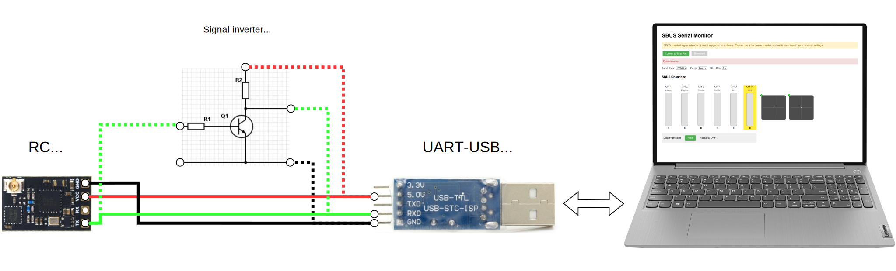
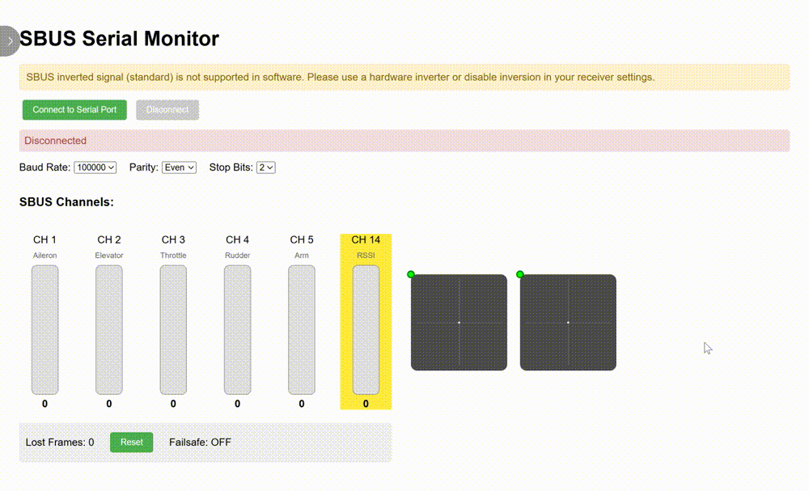

# SBUS-protocol-monitor
Simple SBUS RC protocol viewer.

## Note

**The SBUS inverted signal (standard) is not supported in software. Please use a hardware inverter or disable inversion in your receiver settings.**  

**On channel 14, the "RSSI" value is expected.**

## How to use

1. Connect the RC receiver according to the diagram below.

2. Open "sbus_tester.html" in your browser(must support [Web Serial Api](https://developer.mozilla.org/en-US/docs/Web/API/Web_Serial_API#browser_compatibility)).
3. Click the **Connect to Serial Port** button.
4. Select the port to which the UART-USB converter is connected.
5. Enjoy!

## Preview
 
